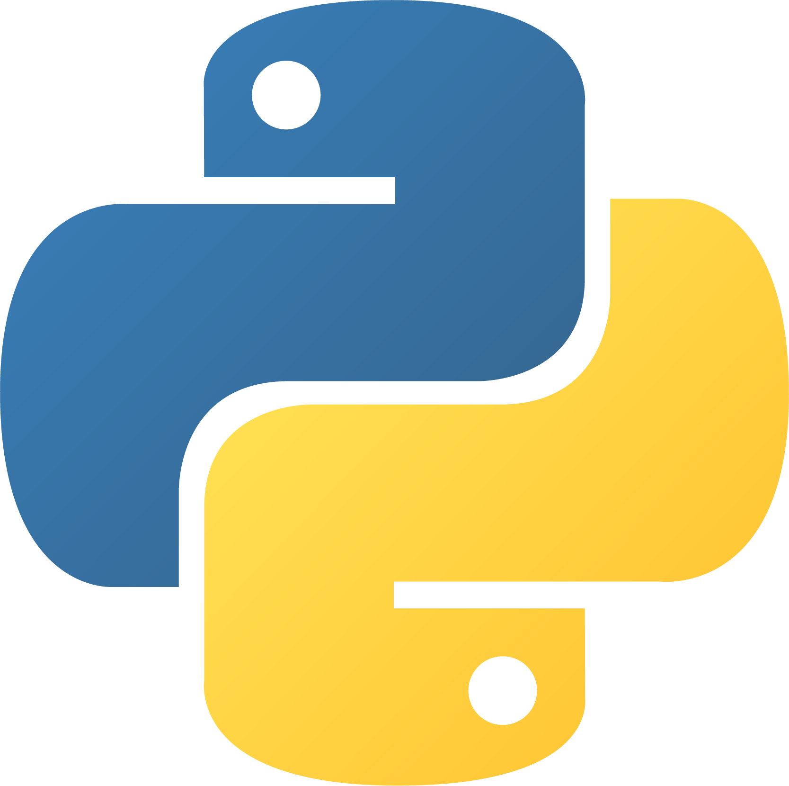
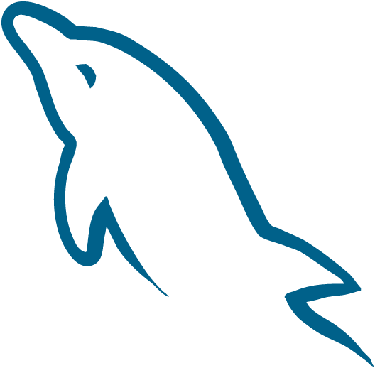
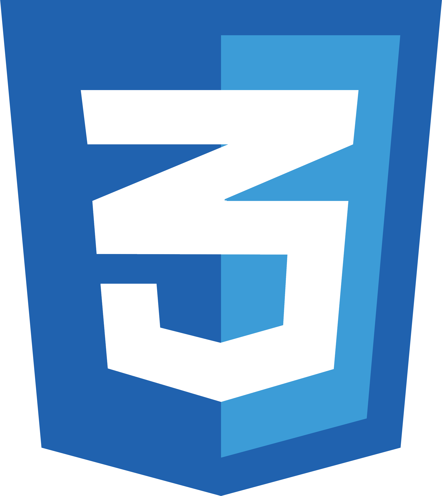
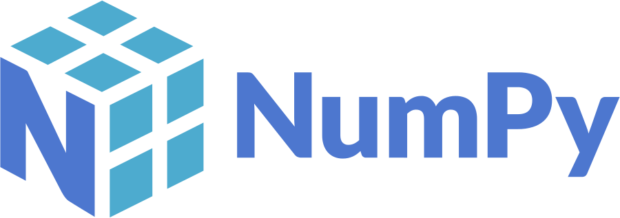
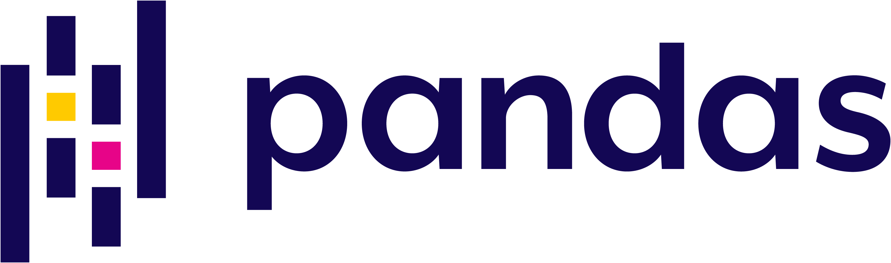
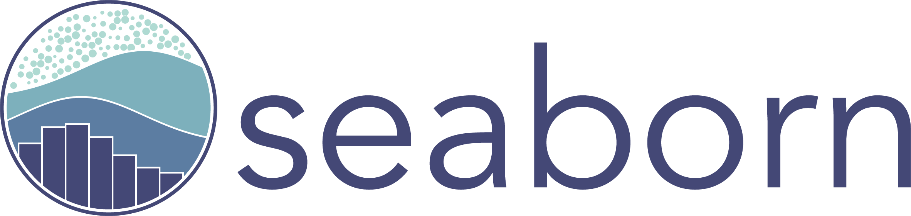
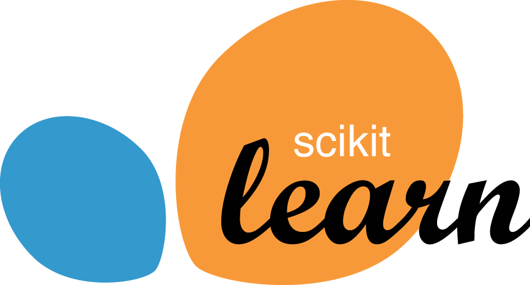
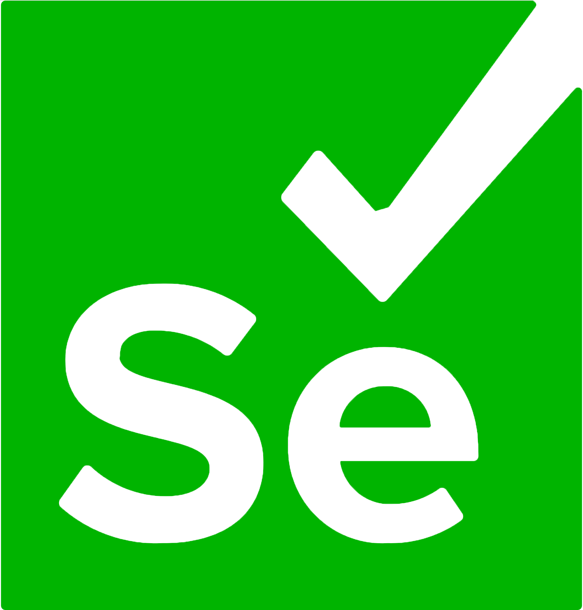
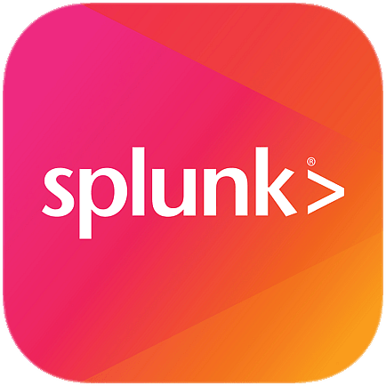
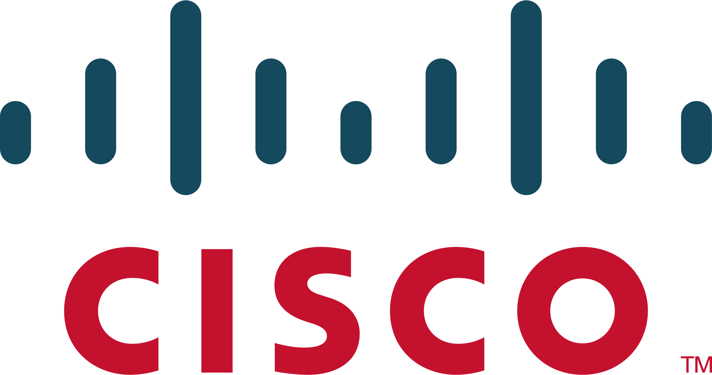

    
 

  <!-- https://git.io/typing-svg -->
  
  <h1> :rocket: Featured Projects </h1>
  

  <ul>
    <li> 
      :honey_pot: <a href="https://github.com/bmattblake/SIEM-Honeypot-Lab">SIEM-Honeypot Lab</a> - Deployed a vulnerable virtual machine to the public internet using Azure Cloud to act as a honeypot. Used Azure Log Analytics Workspace, Microsoft Sentinel (Azure’s cloud SIEM service), and a custom PowerShell script to display global attack data (RDP brute-force) on a world map.
    </li>
    <li> 
      :globe_with_meridians: <a href="https://github.com/bmattblake/IQ-PCAP-Analyzer">Pcap File Analyzer</a> - Command-line utility that can parse PCAP files. Iterates through packets and uses the Ethernet, IP, and TCP/UDP headers to recognize patterns, summarize statistics about the network traffic, and track TCP sessions between two devices.
    </li>
    <li>
      :fish: <a href="https://github.com/bmattblake/Classifying-Phishing-Websites-With-AI/tree/main">Classifying Phishing Websites With AI</a> - Python notebook that details a step-by-step process of cleaning and processing real-world phishing website data collected by the <a href="https://apwg.org/trendsreports/">Anti-Phishing Working Group</a>. Trained an AI model to classify websites as phishing or not phishing based on the website's properties.
    </li>
  </ul>
  

   <h1>	:desktop_computer: Programmer, IT Professional</h1>
  <h5>
  
  
  </h5>

  Hi, my name is Matthew Blake. I am a Cybersecurity Student at Penn State and a Security Risk Management Intern at Exelon. I have the CompTIA Security+ and two years of IT experience, and my technical expertise includes network security, cloud computing, Python programming, and more. 
   
   
  A few things about me:
  <ul>
    <li> :earth_americas: I am based near Washington D.C.</li>
    <li> :envelope: You can contact me on <a href="https://www.linkedin.com/in/matthew-at-psu/"> LinkedIn</a>, or at <a href="mailto:matthew.blake@blake-tech.com"> matthew.blake@blake-tech.com</a></li>
    <li> :rocket: I am currently working on <a href="https://github.com/bmattblake/Classifying-Phishing-Websites-With-AI">Classifying Phishing Websites With AI</a></li>
    <li> :link: Visit my website where I show off my projects at <a href="https://blake-tech.com">blake-tech.com</a></li>
  </ul>

<h2> :man_technologist:Technologies</h2>
<h3>
  Languages:  
  
  
  
  
  
  
  
</h3>
<be>

<h3>
  Libraries/Packages:  
  
  
  
  
  
  
  
  
  
  
</h3>
<h3>
  Tools:  
  
  
  
  
  
  
  
  
  
  
  
</h3>
